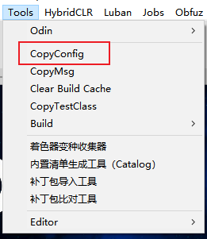
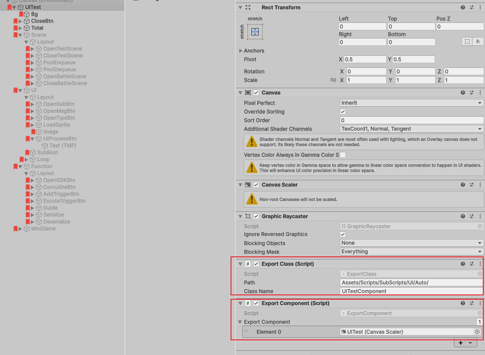

# 快速开始

1. 切换到对应平台<br>
　小游戏建议使用：[unity2022工程地址](https://gitee.com/code10088/game)<br>
　微信小游戏需要在Player中添加宏：WEIXINMINIGAME<br>
　抖音小游戏需要在Player中添加宏：DOUYINMINIGAME<br>
　注意：抖音小游戏需要移除微信导出插件，否则运行报错卡死；微信小游戏不要移除抖音导出插件，运行有报错但不影响；<br>
2. 安装HybridCLR<br>
3. 执行Tools/BuildBundles<br>
4. 导出工程：<br>
　修改Assets/Scripts/MainScripts/GameSetting.cs中的CDN<br>
　配置Preferences/Customer BuildPlayer路径<br>
　执行Tools/BuildProject<br><br><br>


# 最终目标
　周边功能都有一个能用的基础版本，给游戏前端一个参考，让项目从0.5开始<br><br><br>


# 使用文档
## 工程目录结构
　<br>
　Build：打包导出目录、Jenkins打包脚本、版本控制文件<br>
　HelloWorld：工程<br>
　Luban：配置<br>
　NetMsg：protocolbuffer消息<br>
　SDK：Android sdk工程（暂时没有ios）<br><br>
　<br>
　Editor：编辑器工具<br>
　HybridCLRData：Hybrid link<br>
　Obfuz：加密相关配置<br>
　Plugins：sdk、插件<br>
　Scripts：MainScripts：Aot代码    SubScripts：热更代码<br>
　StreamingAssets：首包资源<br>
　TextMesh Pro<br>
　WebGLTemplates：微信导出工具<br>
　WX-WASM-SDK-V2：微信导出工具<br>
　YooAsset<br>
　ZRes：所有资源（Z没有意义，为了使文件夹在最后，便于查找）<br><br>
　<br>
　Assembly：热更程序集<br>
　Audio：音效<br>
　DataConfig：Luban配置数据<br>
　Font：字体<br>
　GameConfig：配置数据<br>
　Model：模型<br>
　Quality：高低端机配置<br>
　Scene：场景相关资源<br>
　Shader<br>
　UI：UI相关资源<br><br>

## Luban配置
　<br>
　Client：客户端代码和数据，数据使用c#_unity_bin<br>
　Datas：配置表，其中ConstConfig.json是常量配置表<br>
　Defines：主要是枚举配置<br>
　gen.bat/gen.sh导出脚本<br>
　其他可参考[luban文档](https://www.datable.cn/docs/intro)<br><br>
　<br>
　Unity工具中执行Tools/CopyConfig会自动执行导出脚本并复制代码和数据到工程中，需要配置Preferences/Customer Luban路径<br><br>

## 资源导入设置
　根据路径匹配，自动设置格式<br>
　音效参考Assets/ZRes/Audio/Sound/Frequence/AudioSetting<br>
　模型参考Assets/ZRes/Model/AModelSetting<br>
　贴图参考Assets/ZRes/Scene/AImportSetting<br>
　Sprite参考Assets/ZRes/UI/Atlas/AImportSetting<br><br>

## 资源管理
　AssetManager包含Yooasset初始化、统一加载卸载接口(不提供同步接口)、获取加载进度<br>
　Load：加载一个或一组资源，返回唯一id<br>
　Unload：根据唯一id卸载资源或资源组，资源会在内存中缓存，根据CacheTime类型设置立即卸载或缓存一段时间<br>
　强烈建议所有资源的加载都使用AssetManager处理，便于切换Addressable/Xasset等其他打包方案<br>
　资源配置文件Assets/YooAsset/Config/AssetBundleCollectorSetting.asset<br>
　其他可参考[Yooasset文档](https://www.yooasset.com/docs/Introduce)<br><br>

## 加密
　代码加密启用了Obfuz所有功能<br>
　资源加密EncryptionServices.cs  DecryptionServices.cs<br>
　其他可参考[Obfuz加密文档](https://www.obfuz.com/docs/intro)<br>
　其他可参考[Yooasset加密文档](https://www.yooasset.com/docs/guide-editor/AssetBundleBuilder#%E8%B5%84%E6%BA%90%E6%96%87%E4%BB%B6%E5%8A%A0%E5%AF%86)<br><br>

## 资源热更
　资源版本配置：Build/VersionConfig.txt<br>
　　　一个AppVersion对应一个ResVersion<br>
　　　对某个AppVersion热更只需要修改其对应ResVersion值即可<br>
　　　如果版本文件中没有配置，说明该AppVersion需要强制更新<br><br>
　代码热更HotUpdateCode<br>
　　　1、检查资源版本<br>
　　　2、Yooasset更新Manifest<br>
　　　3、更新HotUpdateConfig.txt<br>
　　　4、根据HotUpdateConfig.txt进行更新，包含热更代码、补充元数据、资源热更用到的界面和提示弹窗（这样就可以更新资源更新界面）<br><br>
　资源热更HotUpdateResData<br>
　　　下载所有本地不存在或需要更新的资源<br>
　　　WebGl下默认不更新，边玩边下载模式<br>
　　　如果需要静默下载模式，只需要进入游戏后开始资源热更即可<br><br>
　热更界面在Start场景中，出包后无法修改；资源热更界面可以在代码热更过程中更新<br>
　编辑器下热更测试：在ProjectSetting/Player中加入宏HotUpdateDebug、打包不使用obfuz混淆<br><br>

## 打包
　<br>
　HybridCLRGenerate：执行Hybrid GenerateAll并copy热更代码<br>
　YooAssetBuild：bundle打包<br>
　UnloadBundles2CDN：上传bundle到cdn（当前使用腾讯储存桶，需要配置Preferences/Customer腾讯储存桶）<br>
　　　cdn目录结构<br>
　　　　WebGL<br>
　　　　　　VersionConfig.txt(Build目录中)<br>
　　　　　　1.2.0<br>
　　　　　　　　xxx.bundle<br>
　　　　Android<br>
　　　　　　VersionConfig.txt(Build目录中)<br>
　　　　　　1.2.0<br>
　　　　　　　　xxx.bundle<br>
　BuildBundles = HybridCLRGenerate + YooAssetBuild + UnloadBundles2CDN<br>
　BuildProject：导出apk、ipa、微信小游戏工程、抖音小游戏工程<br><br>

## Jenkins配置
　使用Build/JenkinsConfig/jenkins-cli.jar工具创建项目
```
　java -jar jenkins-cli.jar -s http://localhost:8888 -auth qinshuai:123456 create-job HelloWorld HelloWorld.xml<br>
```
　修改Build/UnityBuild.bat中的路径<br>
　修改Jenkins配置中的路径<br><br>

## Pool
　GameObjectPool<T>：缓存一个GameObject，使用异步实例化接口<br>
　GameObjectPool：缓存多个不需要特殊处理的GameObject<br>
　AssetObjectPool<T>：在GameObjectPool<T>基础上增加了资源加载缓存卸载<br>
　AssetObjectPool：在GameObjectPool基础上增加了资源加载缓存卸载<br>
　基本覆盖所有缓存使用场景，具体可以查看代码实现ObjectPool.cs<br><br>

## 组件导出工具
　以UI为例<br>
　<br>
　ExportClass：收集当前节点下（包括当前节点）所有挂载ExportComponent的节点<br>
　　　Path：代码导出路径<br>
　　　ClassName：代码类名，如果需要继承可以这样写UITestComponent:UIComponent<br><br>
　ExportComponent：需要导出的Component，Element为空时导出GameObject<br>
　　　导出属性命名规则：当前节点名+Component名（比如bgImage），所以要求需要导出的节点名不能重复<br><br>
　不仅仅用于UI、Scene，所有需要Find/GetComponent的地方都可以使用<br><br>

## UI
　1、在Luban/Defindes/enum.xml中加入UIType枚举配置<br>
　2、在Luban/Datas/UIConfig.xls中加入相关配置，其中Name是当前UI代码的类型名<br>
　3、所有UI继承于UIBase，里面包含了常用的动画、设置图片、添加特效、复制Prefab等常用接口<br>
　4、UI逻辑参考UITest<br>
　5、UIManager：UI控制类，包含打开关闭UI、缓存卸载UI资源、适配、层级控制<br>
　6、UIPreview：Inspector中预览UI<br>
　特别提醒：<br>
　　　同时打开两个界面，虽然资源加载完成顺序不一定，但UIManager保证UI打开顺序一定会按照代码先后顺序打开<br><br>
   
## Scene
　与UI类似<br>
　1、在Luban/Defindes/enum.xml中加入SceneType枚举配置<br>
　2、在Luban/Datas/SceneConfig.xls中加入相关配置，其中Name是当前Scene代码的类型名<br>
　3、所有Scene继承于SceneBase<br>
　4、Scene逻辑参考TestScene<br>
　5、SceneManager：Scene控制类，包含打开关闭Scene、缓存卸载Scene资源<br>
　特别提醒：<br>
　　同时打开两个场景，虽然资源加载完成顺序不一定，但SceneManager保证Scene打开顺序一定会按照代码先后顺序打开<br>
　　Scene使用Prefab方式制作，这样加载卸载使用AssetManager统一接口<br>
　　每个场景都支持可以打开多个，需要根据id卸载<br><br>

## 网络
　SocketManager：创建、断开链接<br>
　SKCP：udp网络，继承于SBase<br>
　STCP：tcp网络，继承于SBase<br>
　SWeb：websocket网络，继承于SBase<br>
　三种都实现了心跳、断线重连、粘包处理<br>
　序列化/反序列化：为了兼容多种语言，使用protocolbuffer处理，如果需要使用Memorypack等其他库可自行更换<br>
　NetMsgDispatch：解析后的网络消息加入队列在主线程中分发到各个模块<br>
　<br>
　Unity工具中执行Tools/CopyMsg会自动执行导出脚本并复制代码到工程中，需要配置Preferences/Customer Msg路径<br><br>

## 高低端机设置
　Luban/Datas/DeviceInfo.xls配置指定设备分级，Name是手机型号或gpu处理器型号<br>
　没有添加机型或处理器配置的话，根据机器处理器数量和内存自动确定高低档位<br>
　根据档位默认设置帧率、画面质量、阴影质量、抗锯齿、后处理等<br>
　如果需要修改某一项，参考UISetting<br>
　<br><br>

## Debug
　在ProjectSetting/Player中加入宏Debug开启Debug模式，正式上线时需要关闭<br>
　开启Debug后会自动显示Fps和输出窗口<br>
　所有打印使用GameDebug接口，便于关闭Debug后关闭所有输出<br>
　[Fps插件](https://assetstore.unity.com/packages/tools/utilities/advanced-fps-counter-14656?locale=zh-CN&srsltid=AfmBOoome1MyqPBPz_3B2gop6bJsQ75K7b2CwgyLH9adguEeLANzZv1g#description)<br>
　[Debug插件](https://github.com/yasirkula/UnityIngameDebugConsole)<br><br>

## Update管理
　所有每帧刷新逻辑都通过AsyncManager统一管理<br>
　其中分为不切片列表和切片列表，不切片列表每帧刷新，切片列表在cpu负载的时候间隔刷新<br>
　Yooasset中的分帧操作也被归纳到AsyncManager统一管理<br>
　目前所有的代码设计没有依赖Mono，需要每帧刷新的使用Updater管理类<br><br>

## 事件
　EventManager：用于解耦<br><br>

## 多线程
　ThreadManager：结束回调在主线程中运行，避免子线程无法使用GameObject等<br>
　webgl平台为了代码统一，可以使用ThreadManager，只是在主线程中立即执行<br><br>

## 定时器
　TimeManager<br><br>

## 间隔帧
　FrameManager<br><br>

## 特效
　EffectManager：管理场景特效，自带缓存AssetObjectPool<ObjectPoolItem><br><br>

## 音效
　AudioManager：音效、背景音乐，使用AssetManager CacheTime.Short缓存<br><br>

## 协程
　CoroutineManager：c#迭代器取代Unity协程，由于继承于Mono所以也可以调用Unity协程<br><br>

## 数据
　ConfigManager：所有配置数据读取接口<br>
　DataManager：所有网络数据读取接口<br><br>

## PlayerPrefs
　GamePlayerPrefs 兼容微信和抖音的PlayerPrefs统一接口<br><br>

## 执行队列
　ProcessControl 用于流程控制，使逻辑更清晰，参考GameStart；也可以用于进游戏的各种弹窗控制，参考UITest中UIProcess<br><br>

## 微信小游戏
　在ProjectSetting/Player中加入宏WEIXINMINIGAME切换到微信小游戏模式<br><br>

## 抖音小游戏
　在ProjectSetting/Player中加入宏DOUYINMINIGAME切换到抖音小游戏模式<br><br>

## Sdk
　Android：sdk测试代码<br>
　微信：开放域数据、排行榜、各种广告<br>
　抖音：TT初始化、登录、跳转导航栏、排行榜、各种广告<br><br>

## 常用工具
　Alt+D：代替ctrl+d自动按下标命名<br>
　选中GameObject右键Tools/CopyPath复制路径到粘贴板<br>
　Ctrl+→：游戏速度×2<br>
　Ctrl+←：游戏速度÷2<br>
　Ctrl+↓：游戏速度=1<br>
　快进快退快捷键<br><br>

## 具体功能模块
#### 活动
　ActivityData：所有活动数据管理<br>
　ActivityDataBase：活动基类，包含开始、刷新、结束、红点<br>

#### 功能解锁
　Luban/Datas/FunctionUnlockConfig.xls：支持条件组合<br>
　FunctionUnlock<br>

#### 引导
　Luban/Datas/Guide.xls：引导步骤配置<br>
　UIGuideCollect：标记引导步骤中的GameObject<br>
　GuideData：引导开启、下一步、跳过、结束接口<br>
　具体用法可以参考UITest<br>

#### 画面设置
　UISetting：游戏中常用画面质量设置<br>

#### 通用提示、选择界面
　UICommonTips：通用文字提示<br>
　UICommonBox：通用确认取消面板<br>

#### Buff、触发器
　BuffManager：Buff管理<br>
　TriggerManager：触发器管理<br><br><br>

# 后续开发内容
　背包<br>
　邮件<br>
　聊天<br>
　好友<br>
　商城<br>
　选择服务器<br>
　英雄展示<br>
　战队<br>
　道具<br>
　任务<br>
　天赋<br>
　活动：首充、七天签到<br>
